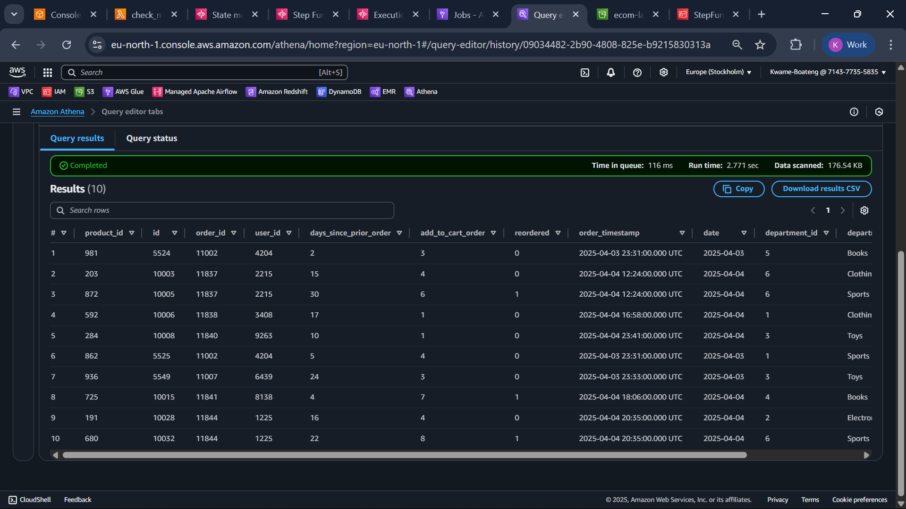
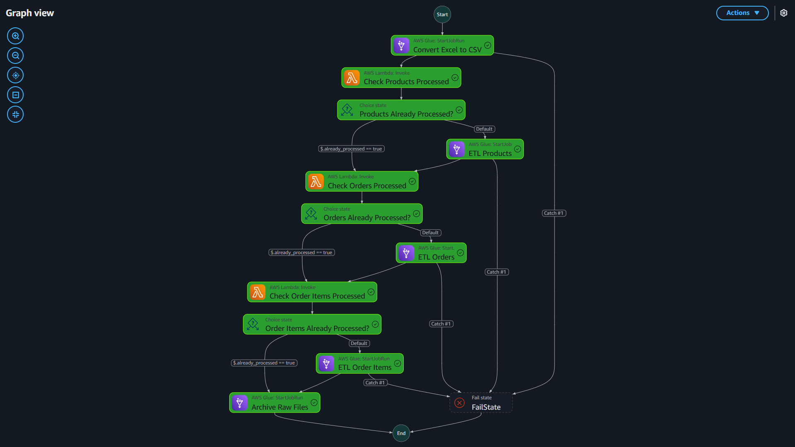

# Lakehouse Pipeline for E-Commerce (AWS)

This project implements a **serverless, production-grade Lakehouse architecture** on AWS for ingesting, transforming, and analyzing e-commerce transactional data.

It covers the full end-to-end workflow, including data ingestion from Excel and CSV files, data deduplication with Delta Lake, metadata cataloging in Glue, orchestration with Step Functions, and querying via Athena.

---

## Architecture Overview

```
                ┌────────────────────────────────┐
                │      GitHub Actions (CI/CD)    │
                └────────────────────────────────┘
                            │
                            ▼
                ┌────────────────────────────────┐
                │      AWS EventBridge           │
                │ Triggers on new S3 uploads     │
                └────────────────────────────────┘
                            │
                            ▼
                ┌────────────────────────────────┐
                │     AWS Step Functions         │
                │ ETL Orchestration + Branching  │
                └────────────────────────────────┘
                            ▼
┌──────────────┐    ┌─────────────────────┐      ┌────────────────────┐
│   Raw S3     │──▶ │ AWS Lambda (Excel→CSV)│ ──▶│ Glue Jobs (Spark)  │
│ uploads/     │    └─────────────────────┘      └────────────────────┘
                            │                              │
                            ▼                              ▼
              ┌────────────────────┐        ┌────────────────────────────┐
              │ S3 /lakehouse/raw/ │        │ S3 /lakehouse/processed/   │
              └────────────────────┘        └────────────────────────────┘
                                                       │
                                                       ▼
                                          ┌────────────────────────────┐
                                          │ Glue Data Catalog + Athena │
                                          └────────────────────────────┘
```

---

## Features

- ✅ **Trigger-based** data ingestion using EventBridge
- ✅ Converts Excel files into per-sheet CSVs with AWS Lambda
- ✅ Distributed ETL using AWS Glue (PySpark + Delta Lake)
- ✅ ACID-compliant Delta Lake tables stored in S3
- ✅ Metadata registration in Glue Data Catalog
- ✅ Query-ready via Amazon Athena
- ✅ Resumable & fault-tolerant workflows with Step Functions
- ✅ GitHub Actions for CI/CD deployment

---

## Project Structure

```
lakehouse-pipeline/
├── glue_jobs/                 # Spark + Python Shell Glue Jobs
│   ├── etl_products.py
│   ├── etl_orders.py
│   ├── etl_order_items.py
│   ├── archive_raw_csvs.py
│   └── convert_excel_to_csv.py
│
├── step_functions/
│   └── lakehouse_etl_flow.json     # Resumable Step Function definition
│
├── sql/                       # Athena query samples
│   ├── validate_orders.sql
│   ├── top_customers.sql
│   └── rejected_records_analysis.sql
│
├── scripts/                   # Optional data CLI/utilities (optional)
│
├── .github/
│   └── workflows/
│       └── deploy.yml         # CI/CD Pipeline
│
├── README.md
└── requirements.txt
```

---

## ETL Workflow Logic (Orchestration)

### Trigger

- Triggered by new `.csv` or `.xlsx` files uploaded to `s3://ecom-lakehouse/uploads/`

### Steps

1. **Lambda**: Converts `.xlsx` → `.csv` per sheet
2. **Marker Check**: `check_marker_lambda` avoids reprocessing files
3. **Glue Jobs**:
   - `etl_products`: Deduplicates and stores product info
   - `etl_orders`: Cleans, timestamps, partitions order data
   - `etl_order_items`: Ensures FK integrity (joins to product)
4. **Delta Writes**: Data stored in `/lakehouse/processed/` in Delta format
5. **Glue Table Registration**: Athena-ready with proper schema
6. **Archival**: Raw CSVs moved to `/archived/` once successfully processed

### Failure Handling

- Branching logic allows job retries or skips gracefully
- System resumes from last unprocessed dataset

---

## Validation Rules

| Rule                          | Applied To                      |
| ----------------------------- | ------------------------------- |
| No null `product_id`          | `etl_products`                  |
| Deduplicate by primary keys   | All jobs                        |
| Valid `order_timestamp`       | `etl_orders`, `etl_order_items` |
| FK integrity (`product_id`)   | `etl_order_items`               |
| Partition by `date`           | `etl_orders`, `etl_order_items` |
| Log rejected records (future) | Extendable                      |

---

## Athena Queries

Use the Glue Data Catalog database: `ecom_catalog`

```sql
-- Preview the first 10 rows for the Orders table
SELECT * 
FROM "ecom_catalog"."orders" 
limit 10;
```

More queries: `sql/`



---

## CI/CD (GitHub Actions)

### `.github/workflows/deploy.yml` handles:

- ✅ Dependency installs
- ✅ Pytest validation (optional)
- ✅ Upload Glue scripts to S3
- ✅ Deploy Step Function via CLI

```bash
# Triggered on push to main
git push origin main
```

---

## Local Dev Requirements

```bash
# requirements.txt
boto3
pandas
openpyxl
pytest
```

You can run scripts locally if needed:

```bash
python glue_jobs/convert_excel_to_csv.py
```

---

## Deploy

### 1. Upload Glue Jobs

```bash
aws s3 cp glue_jobs/ s3://ecom-lakehouse/scripts/ --recursive
```

### 2. Deploy Step Function

```bash
aws stepfunctions update-state-machine   --state-machine-arn arn:aws:states:<region>:<acct>:stateMachine:lakehouse-orchestration   --definition file://step_functions/lakehouse_etl_flow.json
```



---

## Assumptions

- Raw files are always placed under `s3://ecom-lakehouse/uploads/`
- All `.xlsx` are multi-sheet; converted to one CSV per sheet
- Each sheet is uniquely named (avoid collisions)
- Glue job marker check is backed by S3 object or DynamoDB key (customizable)

---

## Future Extensions

- ❗ Rejected record logging to `/rejected/`
- 📩 Add SNS/email alerts for ETL failure
- 🧹 Partition compaction via OPTIMIZE (Delta)
- 🧪 Unit tests for each job in `tests/` folder

---

## Contributors

- **Architect & Engineer**: Kwame A. Boateng
- Contact: *kayboateng@email.com*

---

## License

MIT License 
